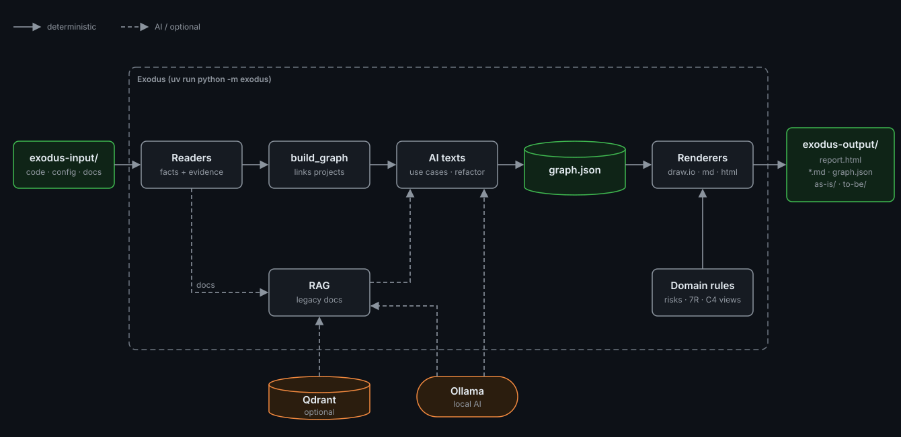

# Exodus

Reads legacy projects — .NET Framework, .NET Core/.NET 5+, Java and Python, monoliths or
microservices — and generates the documentation that supports the decision to migrate to AWS:
AS-IS C4 diagrams, an inventory and the dependency graph between systems. Several projects can
be analyzed together to reveal how they communicate: HTTP/SOAP calls (by URL or by service name,
via Consul/Fabio), events and commands over messaging (Convey/RabbitMQ, MassTransit,
NServiceBus), gateway routes (Ntrada, Ocelot), shared databases (SQL, MongoDB, Redis) and
queues. Dockerfiles and docker-compose files are used as runtime and deployment evidence.

Every generated box and arrow points to the file and line it came from (evidence).

To understand the project (purpose, scope, decisions, limitations): [docs/exodus.md](docs/exodus.md).

## Run

```bash
cd /path/to/exodus          # always from inside the project folder
uv run python -m exodus
```

That is the only command you need. It reads the projects in `exodus-input/`, analyzes them and
generates the diagrams in `exodus-output/`. Exodus is not installed: it runs from this folder
and does not work from any other directory.

The documents for people (`report.html`, `documentation.md`, `rag-trace.md` and the texts the AI
writes) come out in Brazilian Portuguese by default. For English:

```bash
uv run python -m exodus --lang en
```

The other documents and the diagrams are always in English. Switching the language makes the AI
write its texts again on the next run (a few minutes with Ollama); the answers in the other
language stay cached.

### How it works



Readers turn the code, config and docs in `exodus-input/` into facts with evidence, and
`build_graph` links the projects into one graph. The local AI (Ollama) only writes texts on top
of that graph, optionally using the legacy docs through RAG (Qdrant). Migration rules, risks and
C4 views are deterministic, and the renderers write everything to `exodus-output/`.

### First time

1. Install [uv](https://docs.astral.sh/uv/getting-started/installation/) (if you don't have it yet):
   ```bash
   curl -LsSf https://astral.sh/uv/install.sh | sh
   ```
2. In the project folder, set up the environment:
   ```bash
   uv sync
   ```
   uv downloads Python 3.12 and the libraries into `.venv/`, inside the project. Nothing is
   installed system-wide. This step is optional: `uv run` does the same on its first run.

### Step by step

1. Put each legacy project in a subfolder of `exodus-input/` (the folder is created on the first
   run):
   ```
   exodus-input/
     system-a/
     system-b/
   ```
2. Run `uv run python -m exodus`.
   - With a single project, it runs straight away.
   - With more than one, it lists the folders and asks which to analyze: a number (`2`), several
     separated by commas (`1,3`, analyzed together) or Enter for all of them together.

   Real output with the sample project `exodus-input/dotnet-billing/` (a single project, so there
   is no prompt):
   ```
   $ uv run python -m exodus
     wrote exodus-output/dotnet-billing/inventory.md
     wrote exodus-output/dotnet-billing/risks.md
     wrote exodus-output/dotnet-billing/migration.md
     wrote exodus-output/dotnet-billing/overview.md
     wrote exodus-output/dotnet-billing/use-cases.md
     wrote exodus-output/dotnet-billing/graph.json
   Graph: 1 system, 2 container, 4 component, 1 data_store, 1 queue, 3 external_system, 0 platform, 13 relationships
     wrote exodus-output/dotnet-billing/as-is/c4.drawio
     wrote exodus-output/dotnet-billing/to-be/replatform.drawio
     wrote exodus-output/dotnet-billing/to-be/refactor.drawio
     wrote exodus-output/dotnet-billing/to-be/adr/001-structure.md
     wrote exodus-output/dotnet-billing/to-be/adr/002-compute.md
     wrote exodus-output/dotnet-billing/to-be/adr/003-data.md
     wrote exodus-output/dotnet-billing/to-be/adr/004-integration.md
     wrote exodus-output/dotnet-billing/report.html
   Total processing time: 0.1s
   ```
   The last line is the total time, from the start of the analysis to the report (not counting
   the time spent choosing projects). That `0.1s` is with the AI answers already cached; on the
   first run with Ollama, the AI takes a few minutes (for Pacco, about 3 to 5). Between the lines
   above you also see the progress of each step (`→ …` / `✓ … (time)`).
   With more than one project, the list appears first:
   ```
   Projects in exodus-input/:
     1) system-a
     2) system-b
   Choose (numbers separated by commas, Enter = all together):
   ```
3. The result goes to `exodus-output/<project>/` (several projects together: `a+b/`):

   | File | Contents |
   |---|---|
   | **`report.html`** | **Start here.** A single report for decision makers, in the chosen language (`--lang`), that opens offline in the browser (you can email it): summary with the numbers, AS-IS, high risks, migration (7R and waves), TO-BE replatform and refactor with the decisions, and collapsed details (inventory, use cases, components, ADRs). SVG diagrams: click to zoom; hover to see the evidence |
   | `documentation.md` | Documentation of the analyzed system for the team, in the chosen language and without diagrams, following the structure of the [playbook](docs/architecture-master-playbook.md): overview, problem and goals, scope, what it does, constraints/assumptions/dependencies, migration drivers, principles, decisions, how it works, deployment, tests, risks, waves, open questions and glossary. Problem, goals, principles, assumptions and glossary are *inferred* by the AI (each principle cites the fact it is based on); without Ollama, these sections contain the questions for the team to answer |
   | `as-is/c4.drawio` | C4 diagrams, one page per level: L1 (context), L2 (containers of each system) and L3 (components of the 3 main containers of each system) |
   | `to-be/refactor.drawio` | Modernized architecture **proposed by the AI** (local Ollama), one page per system: for each piece, the AWS service chosen from the catalog `exodus/catalog/refactor-catalog.json`, prioritizing cost → security → performance; service merges and splitting of shared databases when it makes sense; the rationale (*inferred*, with confidence) in each box's tooltip. Without Ollama, each piece gets the first catalog option |
   | `to-be/adr/NNN-*.md` | Draft ADRs for the refactor, one per decision group (structure, edge, compute, data, integration, platform, security, observability): context with evidence, catalog options, decision with the inferred rationale and consequences. Regenerated on every `render --to-be` |
   | `to-be/replatform.drawio` | AWS architecture via the fast path (replatform/rehost), one page per system: each container, database, queue and platform service with the icon and target AWS service, the same connections as the AS-IS and a legend by AWS category |
   | `inventory.md` | Inventory: containers (technology, runtime image, deployment), packages, endpoints, databases per server (with the main tables/collections and procedures read from SQL and Mongo in the code), queues, external systems, platform services, messaging (who publishes what to whom), docker-compose services and relationships |
   | `risks.md` | Deterministic migration risks, with severity and evidence: unsupported stack, legacy technologies/packages, secrets, unresolved data sources and shared databases |
   | `migration.md` | Rule-based migration recommendations (no AI): for each container, a fast path (Rehost/Replatform) and a modern path (Refactor) in the AWS **7R** model, target AWS service for each database/queue/platform, Retire candidates and migration waves (foundation first; callees before callers; whatever shares a database moves together) |
   | `overview.md` | Overview and responsibility descriptions; Ollama inferences are flagged with confidence and evidence |
   | `use-cases.md` | Up to 5 main use cases per system, inferred by Ollama from the code of each entry point: trigger, steps (each with a verified file:line) and what is touched (databases, queues, other services) |
   | `graph.json` | Full graph with evidence (format in `graph.schema.json`) |

4. Open `c4.drawio` in [app.diagrams.net](https://app.diagrams.net) (*File → Open from device*),
   in the desktop app or in the *Draw.io Integration* VS Code extension. The pages (L1, L2, L3)
   are in the tabs at the bottom. The evidence for each element and arrow appears in the tooltip
   and in *Edit Data*.

   Element placement (C4 standard, the same at every level): callers on the left, the system in
   the center, external systems on the right, databases and queues at the bottom — inside the
   dashed boundary when they belong to the system, below it when shared. Platform services
   (Consul, Vault, Jaeger, Seq, Prometheus, RabbitMQ…) sit in their own "Platform" group,
   connected to the boundary by a single line. Caches (Redis) are a service detail: they stay out
   of the diagrams and appear in the inventory. Calls, databases and messages appear together on
   the same container diagram.

   A container is a deployable unit (web, API, worker, executable); libraries are part of the
   applications that use them and tests are left out of the diagrams. Exodus warns in the
   terminal when it recognizes nothing in a folder, when a solution (`.sln`) points to missing
   projects and when a system's containers show no communication.

   Arrows are routed by Exodus without crossing boxes; arrows to a database/queue go down and
   enter from the top. When you move a box in draw.io, the arrow keeps its path; to redo it,
   select the arrow and use *Arrange → Waypoints → Clear*.

### Individual commands

```bash
uv run python -m exodus scan <folder> [<folder> ...]  # analysis only (graph.json + inventory.md)
uv run python -m exodus render --as-is                # AS-IS diagrams only, for everything in exodus-output/
uv run python -m exodus render --to-be                # TO-BE (AWS) diagrams only
```

Both accept `-o <folder>` to use a different output folder and `--lang pt-br|en` for the
language of the documents (default `pt-br`). Use the same `--lang` in `scan` and `render`: the AI
texts are written during the scan, the report during the render.

### RAG example: the legacy system's written documentation (optional)

If the legacy code has READMEs, `docs/` folders or `.md`/`.txt`/`.rst`/`.adoc` files, Exodus can
use them for the business sections of `documentation.md` (problem, goals, principles, glossary)
via RAG: the documents are split into chunks, turned into vectors and stored in a local vector
database; for each fixed question, the most similar chunks go to the AI along with the facts
from the code. Everything is local and requires no paid license.

```bash
ollama pull bge-m3          # once: embedding model (MIT, multilingual, ~1.2 GB)
docker compose up -d        # Qdrant (Apache 2.0), vector database; to stop: docker compose down
uv run python -m exodus     # the scan now indexes the documentation and uses what it finds
```

- **Browse the database:** see [Qdrant](#qdrant-rag-vector-database) under "How to access each piece".
- **See what RAG did:** `exodus-output/<project>/rag-trace.md` shows, for each question, the
  retrieved chunks (similarity, source, start of the text) and what the AI wrote with them.
- On each scan only new or changed chunks get embedded; removed ones are deleted from the database.
- Without Qdrant or without `bge-m3`, the scan warns and carries on as before.

Exodus removes lines that look like credential assignments before indexing documentation, but this
is a heuristic. Review legacy documents before scanning them. `exodus-input/` and
`exodus-output/` are Git-ignored because source code, generated reports and AI caches can contain
sensitive project information. Outputs from older Exodus versions need a fresh scan to receive
the current redaction rules; a fresh scan also removes stale chunks from Qdrant.

## How to access each piece

### Input and output

| Piece | Where | How to open |
|---|---|---|
| Legacy projects | `exodus-input/<project>/` | one folder per project (copy or clone the code there) |
| Report | `exodus-output/<project>/report.html` | **in the browser** (double-click or `xdg-open`/`open`); works offline |
| `.md` documents | `exodus-output/<project>/*.md` and `to-be/adr/` | any Markdown editor or viewer (VS Code, GitHub, Obsidian) |
| Diagrams | `exodus-output/<project>/as-is/c4.drawio` and `to-be/*.drawio` | [app.diagrams.net](https://app.diagrams.net) (*File → Open from device*), draw.io desktop or the *Draw.io Integration* VS Code extension |
| Full graph | `exodus-output/<project>/graph.json` (format in `graph.schema.json`) | text editor or `jq` |
| AI caches | `exodus-output/<project>/*-cache.json` | no need to open; delete one to make the AI redo that part on the next scan |

### Ollama (local AI)

- **Where:** local service at http://localhost:11434 (installed outside Docker).
- **Models used:** `qwen3.5:9b` (texts, use cases, refactor) and `bge-m3` (RAG embeddings).
- **Useful commands:**
  ```bash
  ollama list                 # downloaded models
  ollama ps                   # models currently loaded in memory
  ollama pull bge-m3          # download a model
  ollama run qwen3.5:9b       # chat with the model in the terminal (exit: /bye)
  ```

### Qdrant (RAG vector database)

This Compose file is a **local development example**. It binds Qdrant to `127.0.0.1`, so its
unauthenticated API and dashboard are available only from this machine. Indexed document text is
stored in the Qdrant volume. **Do not use this configuration in production.** For a production
deployment, configure authentication, TLS, access controls, network binding, and storage according
to the [Qdrant security guide](https://qdrant.tech/documentation/security/).

```bash
docker compose up -d                 # start (from the project folder)
docker compose ps                    # status: exodus-qdrant-1 ... Up
docker compose logs -f qdrant        # logs (Ctrl+C to exit)
docker compose down                  # stop (data stays in the exodus_qdrant-data volume)
docker compose down -v               # stop AND delete the data (the next scan reindexes everything)
```

**Web dashboard:** http://localhost:6333/dashboard

1. **Collections** → `exodus-<project>` (e.g. `exodus-pacco`): one collection per analyzed
   project.
2. Inside the collection:
   - **Points:** each point is a documentation chunk. The *payload* shows `text` (the chunk),
     `title` (section title) and `source` (`file:line` it came from). This is what RAG "knows".
   - **Info:** number of points, vector size (1024, from `bge-m3`) and the distance (Cosine).
   - **Visualize:** projects the vectors in 2D; chunks on similar topics end up close together.
   - **Graph:** links each point to its most similar neighbors.
3. **Console** (side menu): runs API calls directly in the dashboard, for example:
   ```
   GET collections/exodus-pacco

   POST collections/exodus-pacco/points/scroll
   { "limit": 5, "with_payload": true }
   ```

**Search by meaning (the way Exodus does it):** the search needs the question's vector, which
comes from `bge-m3` in Ollama. In the terminal (the question is in Portuguese — "What business
problem does the system solve?"; `bge-m3` is multilingual, so a question in either language
finds the same pieces):

```bash
Q="Qual problema de negócio o sistema resolve?"
curl -s localhost:11434/api/embed -d "{\"model\":\"bge-m3\",\"input\":\"$Q\"}" \
  | python3 -c "import json,sys; print(json.dumps({'vector': json.load(sys.stdin)['embeddings'][0], 'limit': 3, 'with_payload': True}))" \
  | curl -s localhost:6333/collections/exodus-pacco/points/search -H 'Content-Type: application/json' -d @- \
  | python3 -c "import json,sys; [print(round(p['score'],3), p['payload']['source'], p['payload']['title']) for p in json.load(sys.stdin)['result']]"
```

Real output (Pacco):
```
0.488 Pacco/README.md:10 README.md
0.484 Pacco/README.md:19 What is Pacco?
0.471 Pacco/README.md:6 What is Pacco?
```

The number is the similarity (the higher, the closer to the question; Exodus discards anything
below 0.45). The questions Exodus asks and the chunks it used are in
`exodus-output/<project>/rag-trace.md`.

## Development

```bash
uv run pytest                                          # behavior and integration tests
uv run ruff check . && uv run ruff format --check .    # lint and formatting
uv run mypy --strict exodus                            # types
```

Clean architecture: `exodus/domain` (model and rules), `exodus/application` (use cases and
ports), `exodus/infrastructure` (code/config readers and renderers) and `exodus/interfaces/cli`.
Each language or config format is a reader (`FactExtractor`) registered in `exodus/main.py`.
The end-to-end tests use the mini project `tests/fixtures/tiny-shop/`. The project rules are in
`CLAUDE.md`.
